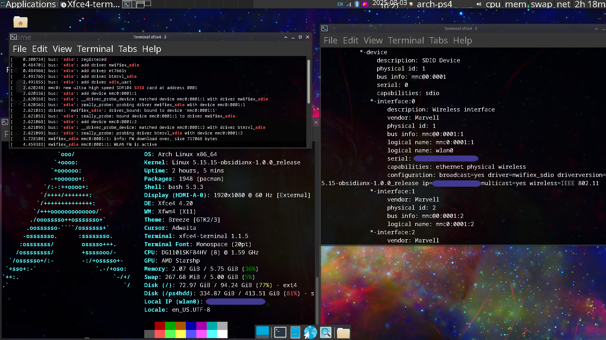

Linux Kernel - On the Sony PlayStation 4
========================================

This is a Linux Kernel source tailored to run on exploitable PlayStation 4 systems with various subsystem patches from     
the [fail0verflow team](https://github.com/fail0verflow/ps4-linux),    
[eeply](https://github.com/eeply/ps4-linux),    
[Ps3itaTeam](https://github.com/Ps3itaTeam/ps4-linux),   
[rancido](https://github.com/rancido),    
valeryy (no Github - contributed to PS4 Baikal southbridges),    
[mircoho](https://github.com/ps4gentoo/ps4-linux-5.3.7),    
[codedwrench](https://github.com/codedwrench/ps4-linux/),    
[tihmstar](https://github.com/tihmstar/ps4-linux/tree/ps4-4.14.93-belize),    
[crashniels](https://github.com/crashniels/linux/),     
[saya](https://www.youtube.com/channel/UCc20KAcPCj9Ut8IQF3umSjg),    
[whitehax0r](https://github.com/whitehax0r/ps4-linux-baikal),    
[DFAUS](https://github.com/DFAUS-git/ps4-baikal-5.4.247-kernel) -- and others.

This fork aimed to make the internal WiFi+Bluetooth modules on specific PlayStation models with the Marvell    
88w8897 combo card (internal codename Torus 2) functional, as they typically error out on the default kernels.

Over time, I also managed to fix the common blackscreen at GUI login issue on newer kernels, and added
support for various miscellaneous components such as the MT7668 WiFi and BT chip on certain consoles.    
The branch names are meant to be descriptive and provide an idea, but they're far from perfect!

Merging all the main fixes into a few distinct branches is a WIP.


-------

The console models that are known to have the Torus 2 module, and their testing results from this patched kernel are:
``` 
CUH-1216(A/B) { WiFi: Functional | Bluetooth: Functional }    
CUH-1215(A/B) { WiFi: Functional | Bluetooth: Functional }
CUH-1003      { WiFi: Functional? | Bluetooth: Functional? }
[A and B are just hard-drive specification: 500 GB vs 1000GB].   
```

<br>

- TODO: Add a list with all supported console models, their southbridges, and their compatible kernels.

---- 
<br>

The main patches which in combination fix the module are:     
[150 MHz rate limit quirk on the 88w8897 card's Function 0](https://github.com/feeRnt/ps4-linux-12xx/commit/df7f7dbb1b0fff6026e159540f029988c8067b70).

relying on the [patch for added sdio_id for the Function 0](https://github.com/feeRnt/ps4-linux-12xx/commit/f4835fb020010acff2b70e4c5fa9430e07f0073b),

Then a [few SDHCI Host quirks for the PlayStation SDHCI host](https://github.com/feeRnt/ps4-linux-12xx/commit/e6f342df7737722d5e27f0ae3974e493c5fe4ca4),

additionally with [extra retries for MMC CMD 52 or 53, which it would usually fail on](https://github.com/feeRnt/ps4-linux-12xx/commit/c57162e5ec7a4aa3af3310a36dc963b5c0298dfe).

The primary culprit behind the failed SDIO initialization, seems to be that the card doesn't properly support 208 or 200 MHz clock rate on this PS4 SDHCI host, causing the card to show tuning and other command failures.    
Through much trial and error, I was able to reach such an arcane fix,     
<br>


and here is an image with working internal WiFi and Bluetooth as shown in the logs, on an Arch Linux system running on my CUH-1216 console:    
<br>

<br>

Hard work paid off!

There are different branches that you can select on the repo,    
`ps4-linux-5.15.y` and `ps4-linux-5.15.y-conservative2` are branches with excessive debug logs, that helped me pinpoint the issue on the whole MMC stack. Due to the logging, it is not advisable to use those kernel branches.    

The `ps4-linux-5.15.y-fix` is a branch without the PS4 patches from codedwrench's Baikal branch. It still
runs as intended (no blackscreen fix yet), but you will get bad errors, even on Aeolia/Belize consoles. Should be used for testing only. 

However, it probably runs on Aeolia consoles unlike the \*-belize branches. (Not tested yet)


The main release branches are:    
- `ps4-linux-5.15.15-fix-belize` : The clean WiFi fix branch for Kernel version 5.15.15 on Belize southbridges.    

- `ps4-linux-5.15.15-fix-baikal` : The clean WiFi fix branch for Kernel version 5.15.15 on Baikal southbridges.    
Baikals don't have the WiFi/BT issue fixed here, but it's kept for testing only.    

- `ps4-linux-5.15.15-fix-belize_mt7668` : The branch for testing the MT7668 chip on Belize consoles...    
Use this if you'd like to test WiFi and bluetooth functionality on a console with this chip.

- `ps4-linux-5.15.189-fix-belize` : The clean WiFi fix branch for Kernel version 5.15.189 on Belize southbridges.

- `ps4-linux-5.4.247-baikal-dfaus: A branch for version 5.4.247 with fixed blackscreen and MT7668 support for Baikal southbridges.    
Based on DFAUS' source.

- `ps4-linux-6.15.y-crashniels` : The clean WiFi fix branch for Kernel version 6.15.4, on Aeolia/Belize southbridges.    
Based on crashniels' source.

To compile them, you can simply fork the repo, go to the Actions tab and run the Workflow file for `build-kernel_latest.yaml` for a particular branch.

Or if you would like to build locally, just clone the repo for your desired branch and run:
```bash
mv config .config

export MAKE_OPTS="-j`nproc` \
              HOSTCC=gcc-11 \
              CC=gcc-11"
# gcc-11 is ideal for compiling the 5.15.y kernels, otherwise you will have many typecheck and compile errors 
make ${MAKE_OPTS} olddefconfig
make ${MAKE_OPTS} prepare
echo "making kernel. . ."
make ${MAKE_OPTS}
echo "making modules . . ."
make ${MAKE_OPTS} modules
echo "installing kernel . . ."
make ${MAKE_OPTS} install
echo "installing modules . . ."
make ${MAKE_OPTS} modules_install
```

To get some pre-compiled kernels, go to the [releases section](https://github.com/feeRnt/ps4-linux-12xx/releases), and choose a kernel (bzImage) based on your needed version.

If something doesn't work, or your model still has unsupported WiFi, you can open a GitHub issue to share its details.

=-=-=-=

<br>
<br>
======== Generic Linux Kernel Doucmentation: ========


There are several guides for kernel developers and users. These guides can
be rendered in a number of formats, like HTML and PDF. Please read
Documentation/admin-guide/README.rst first.

In order to build the documentation, use ``make htmldocs`` or
``make pdfdocs``.  The formatted documentation can also be read online at:

    https://www.kernel.org/doc/html/latest/

There are various text files in the Documentation/ subdirectory,
several of them using the Restructured Text markup notation.

Please read the Documentation/process/changes.rst file, as it contains the
requirements for building and running the kernel, and information about
the problems which may result by upgrading your kernel.
